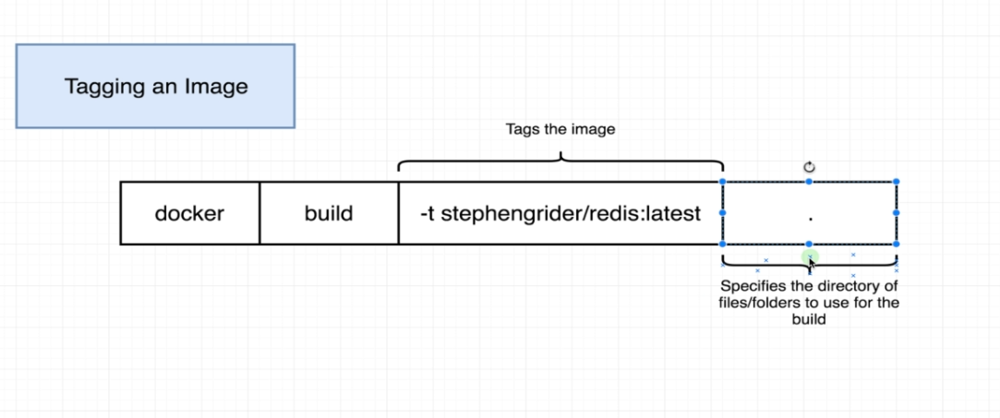

# Tagging an image

```bash
docker build commands
```

## Usage

```bash
docker build -t dockerHubId/projectName:version .
```


```bash
dockerHubId/projectName:version
```


## License

[MIT](https://choosealicense.com/licenses/mit/)